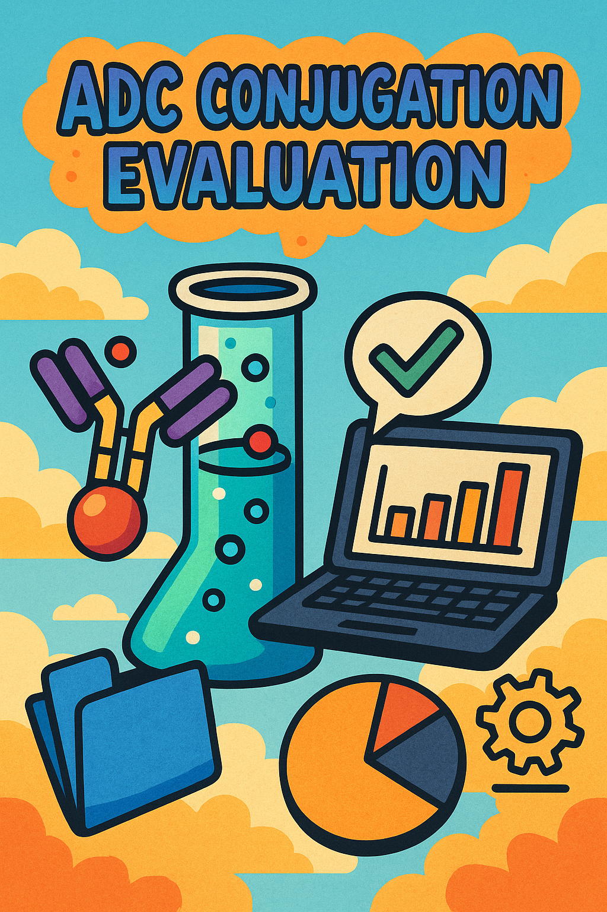

# 🧪 Python-Based ML Model for ADC Conjugation Platform Selection

_A data-driven framework to evaluate antibody-drug conjugation (ADC) technologies using Python and machine learning._

A curated guide and decision-support tool to aid scientists in selecting optimal conjugation strategies for antibody-drug conjugates (ADCs), including summaries of current technologies, platform comparisons, and use-case recommendations.

# ADC Conjugation Technology Evaluation

## Overview

This project evaluates Antibody-Drug Conjugate (ADC) conjugation technologies using synthetic and real-world datasets. The goal is to explore, analyze, and model ADC conjugation platforms to support informed technology selection and recommendation for ADC development.

---

## Project Structure

| File / Notebook                      | Description                                                                                  |
|------------------------------------|----------------------------------------------------------------------------------------------|
| `adc_conjugation_synthetic_advanced.csv` | Synthetic dataset simulating various ADC conjugation platforms with realistic metrics.        |
| `rf_adc_pipeline.pkl`               | Pretrained Random Forest model pipeline for ADC platform classification and recommendation. |
| `01_data_exploration.ipynb`         | Exploratory data analysis notebook: statistics, visualization, platform comparison.          |
| `02_model_selection.ipynb`          | Model training and evaluation: Logistic Regression, Random Forest, GBM; saves best model.    |
| `03_platform_recommender.ipynb`     | Interactive platform recommender with Gradio UI using pretrained ML model and PDF reports.   |
| `synthetic_data_generator.ipynb`    | Script generating the synthetic ADC conjugation dataset; used to validate notebooks and repo.|

---

## About This Project

### Goal

- Explore and interpret ADC conjugation technology data  
- Understand key attributes like Drug-to-Antibody Ratio (DAR), stability, homogeneity, manufacturability, and cost  
- Train predictive models to recommend the optimal conjugation platform for an ADC candidate  
- Provide a user-friendly tool with automated PDF reports for decision support  

### Dataset Highlights

- Includes multiple conjugation platforms: Random, Site-Specific Non-Selective, and Site-Specific Selective  
- Metrics cover DAR mean, DAR coefficient of variation, stability scores, homogeneity, expression ease, cost, manufacturability (scalability), and CMC risk  
- Data simulates batch variations and is inspired by public ADC developer platforms (WuXi Biologics, Genentech, Seagen, etc.) and scientific literature (Antibody Therapeutics 2025)  

---

## Reports

- **adc_data_report.pdf**  
  Generated by running `synthetic_data_generator.ipynb`. This report provides detailed exploratory analysis and validation of the synthetic ADC conjugation dataset, including correlation heatmaps, boxplots, violin plots, and interactive visualizations.

- **adc_platform_report.pdf**  
  Generated by running `03_platform_recommender.ipynb`. This report is an automated PDF summary of the recommended ADC conjugation platform for a given candidate, based on the pretrained ML model and input parameters.

---

## Usage

### 1. Data Exploration

Run `01_data_exploration.ipynb` to:

- Load and validate the dataset  
- Generate correlation heatmaps, boxplots, violin plots  
- Visualize DAR mean vs. homogeneity with interactive Plotly scatterplots  
- Generate an automated HTML and PDF report summarizing data insights  

### 2. Model Training & Selection

Use `02_model_selection.ipynb` to:

- Preprocess features and labels  
- Train and evaluate multiple classification models (Logistic Regression, Random Forest, Gradient Boosting)  
- Save the best performing model (`rf_adc_pipeline.pkl`)  

### 3. Platform Recommendation

Launch `03_platform_recommender.ipynb` for:

- An interactive Gradio app that takes input parameters of ADC candidates  
- Predicts the optimal conjugation platform using the pretrained model  
- Generates and downloads the `adc_platform_report.pdf` detailing the recommendation and rationale  

### 4. Generate & Validate Synthetic Data

Run `synthetic_data_generator.ipynb` to:

- Generate the synthetic ADC conjugation dataset (`adc_conjugation_synthetic_advanced.csv`)  
- Validate dataset assumptions and notebook workflows  
- Produce the comprehensive exploratory report `adc_data_report.pdf`  

---

### 🔄 System Overview

#### 1. 🧪 User Inputs (via Gradio)
- Technology_Category  
- DAR_Mean, DAR_Std, DAR_CV  
- Stability_Score, Expression_Ease  
- Homogeneity, Cost_Index  
- CMC_Risk, Approved_Usage, Vendor  
- Scalability, Latency_to_Clinic_yrs  

#### 2. 🧹 Data Preprocessing (Pipeline in `.pkl`)
- Convert categoricals to string  
- One-hot / ordinal encoding  
- Normalize and scale numerical values  

#### 3. 🧠 Trained ML Model (Random Forest)
- Trained on historical ADC project data  
- Learns platform suitability from patterns  
- Predicts platform label  

#### 4. ✅ Output
- Predicted Platform (e.g., "Lysine-Based")  
- Displayed in Gradio interface  
- Exported in downloadable PDF report  

---

## Installation

Make sure you have the following installed:

- Python 3.8+  
- Jupyter Notebook  
- Required Python packages:

```bash
pip install pandas numpy scikit-learn matplotlib seaborn plotly gradio pdfkit jinja2
```
## Technologies Used
Python (pandas, numpy, scikit-learn)
Jupyter Notebooks
Plotly, Seaborn, Matplotlib for visualization
Gradio for interactive UI
pdfkit + wkhtmltopdf for report generation
Jinja2 templating

## Contributing
Contributions are welcome! Please open issues or submit pull requests for improvements, new features, or bug fixes.

## Contact
For questions or collaboration, please contact:
Carlos Montefusco – cmontefusco@gmail.com
Project Link: https://github.com/camontefusco/adc-conjugation-evaluation

---

## Credits & References

- ADC technology data synthesized from public platform specs by WuXi Biologics, Synaffix, Genentech, Daiichi Sankyo, ImmunoGen, Seagen  
- Literature references:  
  - Antibody Therapeutics (2025) review, DAR pharmacokinetic variability studies  
  - [Ab Therapeutics, Vol 8, Issue 2, Pages 157–176 (2025)](https://academic.oup.com/abt/article/8/2/157/8115463) — Comprehensive review on ADC conjugation technologies and clinical translation  
- Open-source libraries: Pandas, Scikit-learn, Seaborn, Plotly, Gradio, pdfkit, Jinja2  

---
